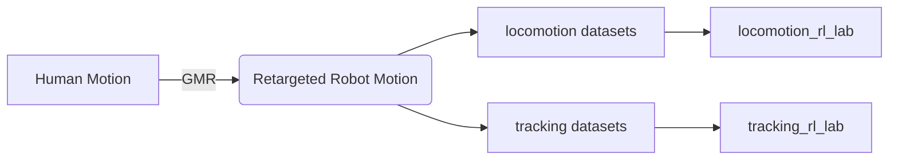
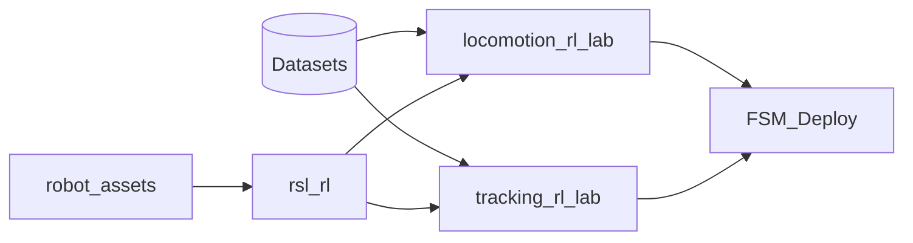
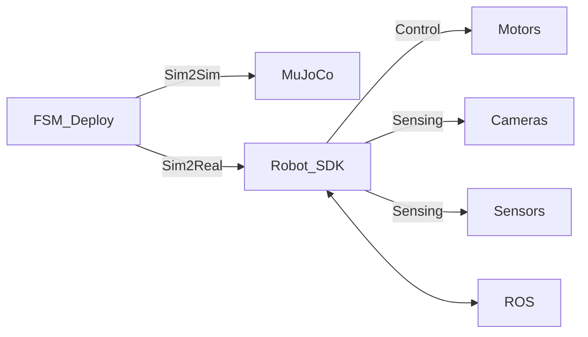

# 🤖 HiThink Robotics Codebase Overview

> *One-stack to go from human motion → robot policy → real deployment.*

---

## 🌐 System Architecture (Three-Stream View)

### 1️⃣ 🔁 Data Flow  
*From humans to robot-ready datasets*

---

### 2️⃣ 🧠 Training Flow  
*Policy learning & evaluation*

---

### 3️⃣ ⚙️ Software-Hardware Interface Flow  
*From sim to real robot*

> 💡 **Tip**: Render these diagrams using any Mermaid-compatible viewer (e.g., VS Code + Mermaid extension, Obsidian, or [mermaid.live](https://mermaid.live)).

---

## 🧱 Core Code Repositories

| Repository             | Purpose |
|------------------------|---------|
| `robot_assets`         | Unified storage of robot geometry & descriptions (meshes, URDF, MJCF, USD) |
| `locomotion_rl_lab`    | Locomotion policy training (walk/run/jump) |
| `tracking_rl_lab`      | Target-following & visual tracking policy training |
| `rsl_rl`               | Core reinforcement learning algorithms & utilities |
| `FSM_Deploy`           | Sim2Sim & Sim2Real deployment framework |
| `GMR`                  | Human-to-robot motion retargeting |
| `HiThink-Nexus-Humanoid.github.io` | Project documentation & demos |

---

> ✅ **All repositories are actively maintained.**  
> 📅 Last updated: November 21, 2025
